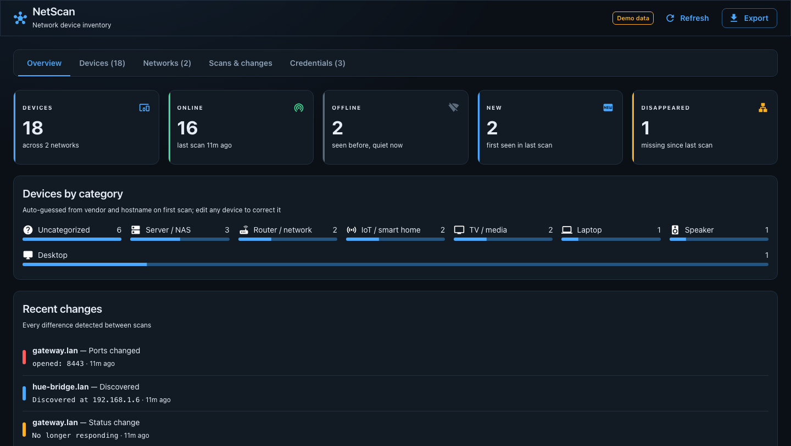
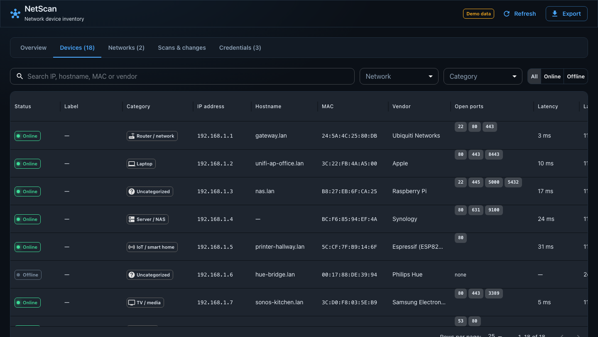
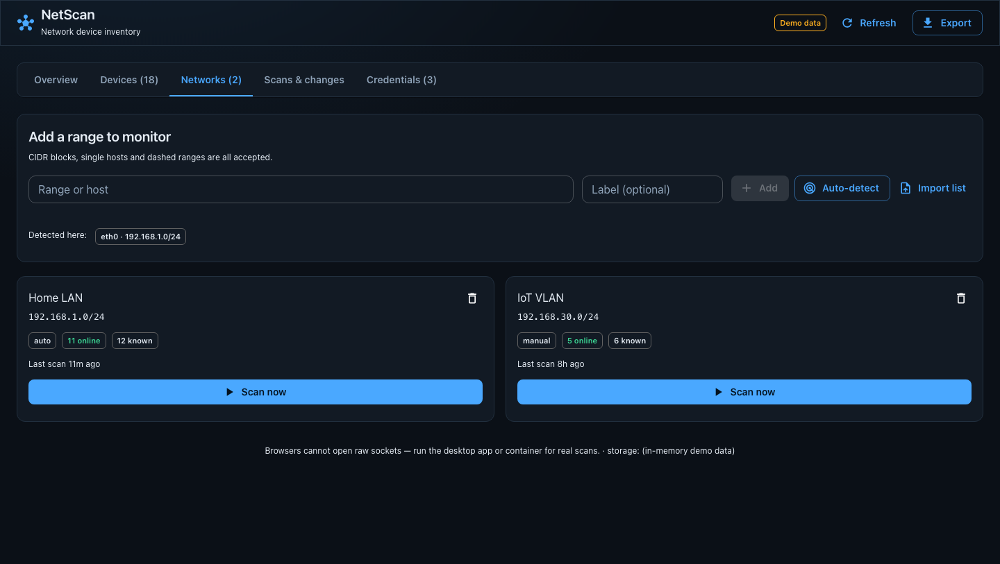
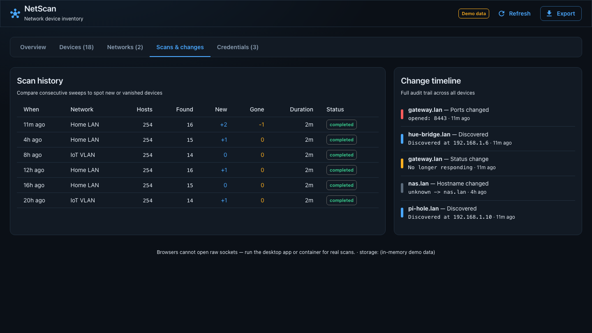
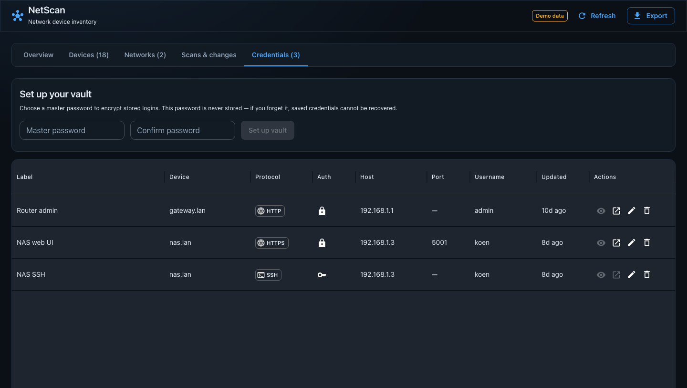

# NetScan

A local network device inventory app. NetScan sweeps your LAN, records every device it finds — IP,
hostname, MAC address, vendor, online status and open ports — and keeps a history of scans so you can
see what changed: new devices, devices that went offline, or ports that opened up.

It runs as a **desktop app (Electron)** or a **Docker container**, both doing real ICMP/ARP/TCP scanning
against your network. A web preview is also available for browsing the UI with demo data (browsers
can't open raw sockets, so no real scanning happens there).

## Features

- **Network discovery** — sweep any CIDR range, single hosts, or a list of addresses; auto-detects the
  local subnet for you.
- **Device inventory** — IP, hostname, MAC + vendor lookup, open ports, latency and online/offline status
  for every device seen.
- **Live ping** — from a device's details, start a continuous ping and watch replies stream in in
  real time, with running sent/received/loss and min/avg/max latency stats.
- **Auto-categorization** — devices are guessed into categories (router, NAS, IoT, TV, laptop, ...) from
  vendor and hostname, editable per device.
- **Scan history & change tracking** — every scan is stored, so you can compare runs and see a full
  timeline of what appeared, disappeared, or changed.
- **Multiple networks** — monitor several ranges (e.g. a home LAN and an IoT VLAN) side by side.
- **Credential vault** — optionally store logins for your devices (router admin, NAS, SSH, ...) behind a
  master password, for quick access from the inventory.
- **Export** — dump the full inventory for use elsewhere.

## Screenshots

**Overview** — device counts, categories, and recent changes at a glance.



**Devices** — the full inventory, searchable and filterable by network, category and status.



**Networks** — add ranges to monitor and trigger scans.



**Scans & changes** — scan history and a full audit trail of device changes.



**Credentials** — an encrypted vault for device logins.



## Running it

```sh
git clone <this-repository-url>
cd netscan
npm i
```

| Mode                     | Scanning                    | Run with                |
| ------------------------ | ---------------------------- | ------------------------ |
| Web preview (demo data)  | none — UI only               | `npm run dev`             |
| Desktop app (Electron)   | real ICMP/ARP/TCP            | `npm run electron`        |
| Container (Docker)       | real, on the host network    | `npm run docker:up`       |

Docker needs `network_mode: host` plus `NET_RAW`/`NET_ADMIN` for real LAN access (works best on Linux
hosts). Once running, it's served at `http://localhost:8099`.

Packaged desktop builds:

```sh
npm run package:linux   # electron-release/NetScan-linux-x64
npm run package:win
npm run package:mac
```

See [CLAUDE.md](CLAUDE.md) for architecture details.
